# Architecture: Infinity-Style Cloud Computer MVP

## 1. System Architecture

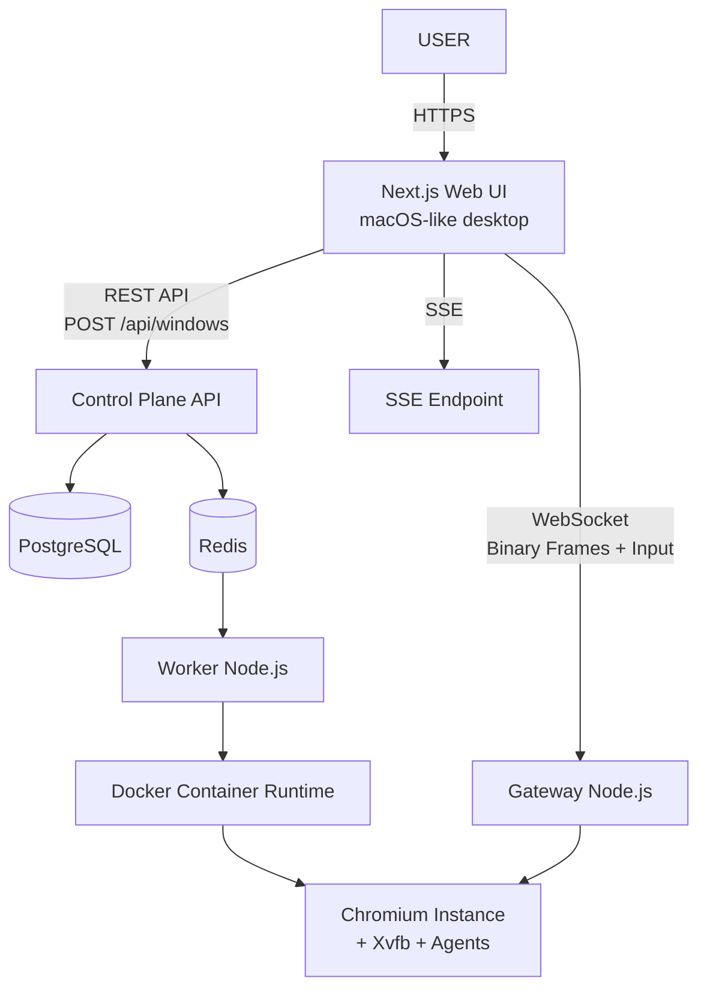

## 2. Control Plane

The Control Plane handles the lifecycle of instances. It is separated from the Data Plane.

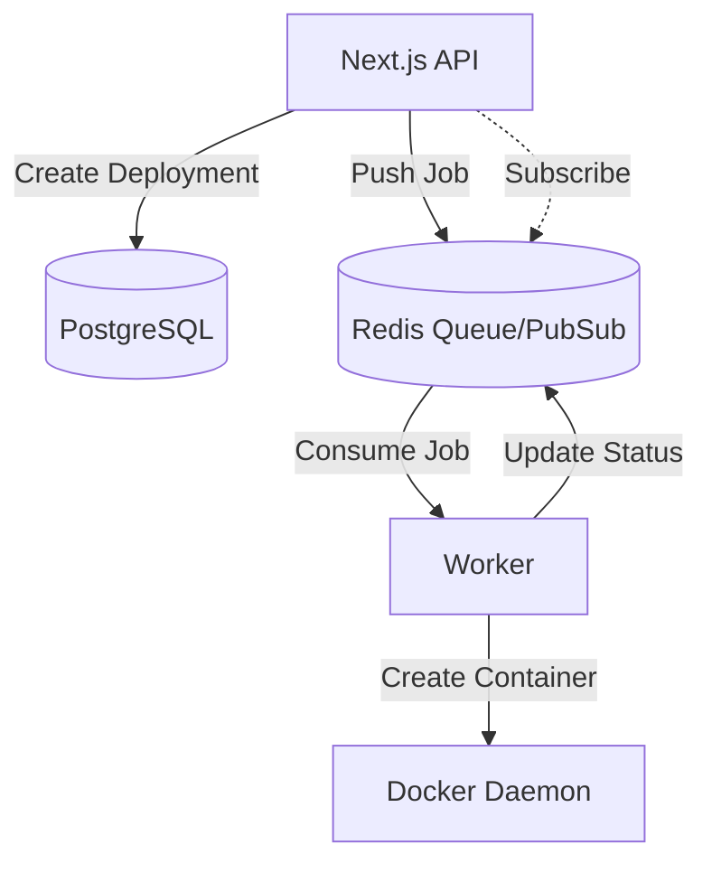

## 3. Data Plane

The Data Plane routes high-frequency real-time traffic.

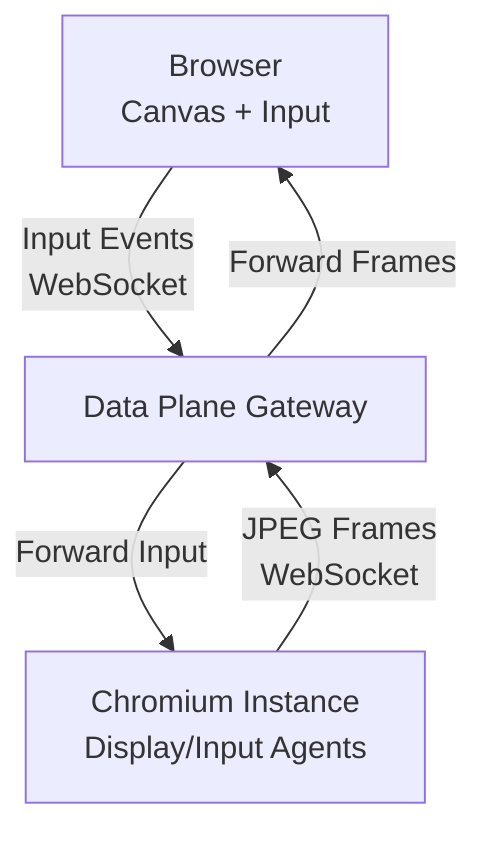

## 4. Deployment Lifecycle

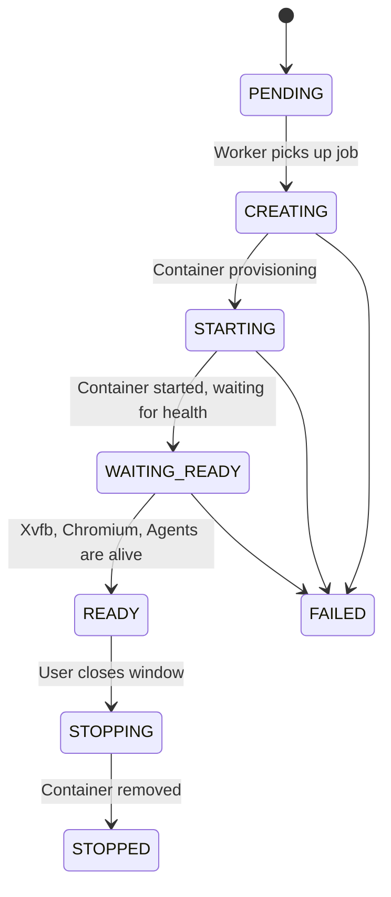

## 5. SSE Lifecycle

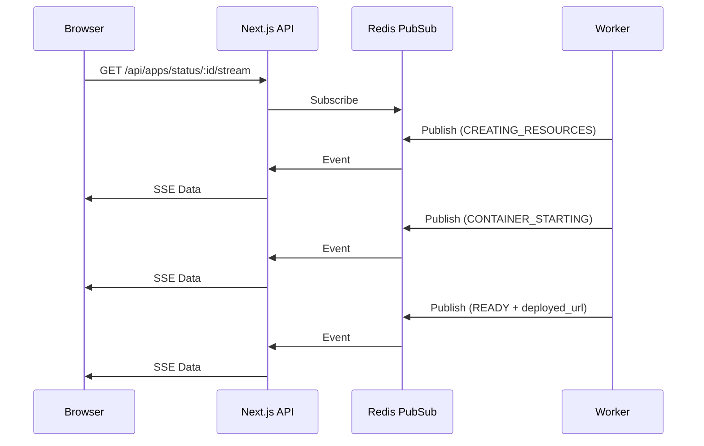

## 6. Container Architecture

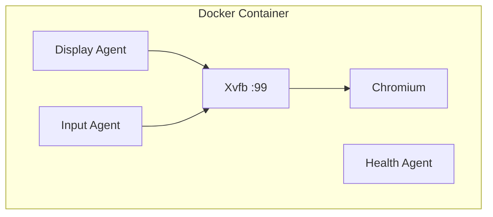

## 7. Display Pipeline

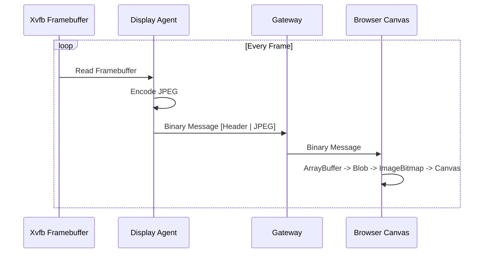

## 8. Input Pipeline

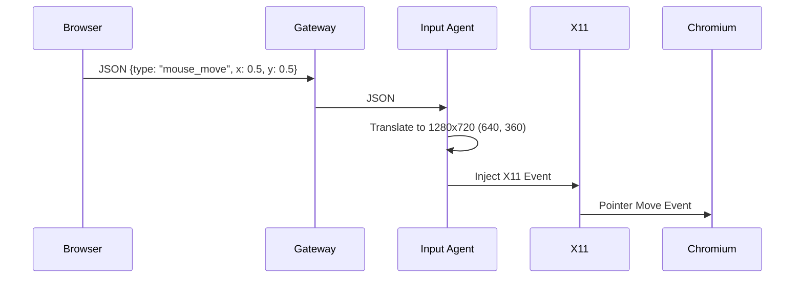

## 9. Gateway Routing

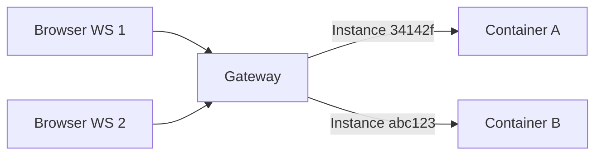

## 10. Reconnect Behavior

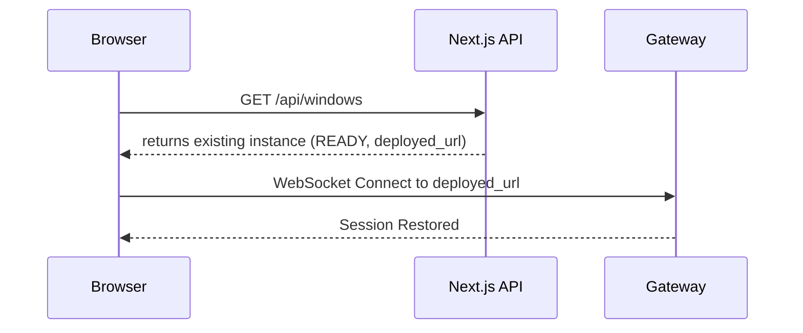

## 11. Failure Behavior

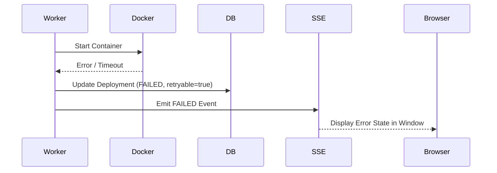

## 12. Security Boundaries

- The Chromium container runs as a non-root user.
- strict limits on CPU, memory, PIDs.
- No host filesystem mounts.
- No Docker socket mounts.
- Browser connects only to Gateway, never directly to Docker.
- Gateway enforces session validation before forwarding to runtime.

## 13. WebRTC Architecture

Real-time streaming uses WebRTC (Media Tracks + RTCDataChannel) with Gateway serving as the WebRTC Signaling server:

```mermaid
graph TD
    Browser[Browser <video> + RTCDataChannel]
    Signaling[Gateway Signaling Server ws://localhost:4001]
    STUN[STUN Server stun:stun.l.google.com:19302]
    Remote[Runtime Container Video Track + Input Agent]
    
    Browser <-->|Signaling SDP Offer/Answer/ICE| Signaling
    Remote <-->|Signaling SDP Offer/Answer/ICE| Signaling
    Browser <-->|STUN Candidate Discovery| STUN
    
    Browser <==|WebRTC Video Track (H.264/VP8/VP9)| Remote
    Browser <==|RTCDataChannel Input Events (Mouse/Keyboard/Scroll)| Remote
```

### WebRTC Advantages:
- **Sub-50ms Latency**: Native hardware-accelerated video decoding directly in `<video>` element.
- **Zero Jitter Overhead**: WebRTC Media Engine dynamically adjusts bitrate, resolution, and framerate based on network conditions.
- **Low Overhead Inputs**: Mouse, keyboard, scroll, and resize input events transmitted over UDP-based `RTCDataChannel`.

