# Architecture: Orbit

## 1. System Overview

Orbit is a cloud computer: users open application windows (Chromium, VS Code, Terminal) in a macOS-like web desktop. Each window is backed by a Docker container running the real application inside a virtual display, streamed to the browser over WebRTC.

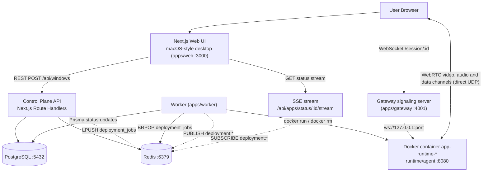

### Components

| Component | Location | Role |
| --- | --- | --- |
| Web | `apps/web` | macOS-style desktop UI, control plane REST API, SSE progress streams, Google OAuth |
| Gateway | `apps/gateway` | WebSocket signaling relay between browser and runtime agent, session authorization |
| Worker | `apps/worker` | Consumes the Redis deployment queue, manages the Docker container lifecycle |
| Runtime agent | `runtime/agent` | Runs inside each container: virtual display, media encoding, input injection, WebRTC |
| Shared packages | `packages/*` | `db` (Prisma), `redis`, `protocol` (zod), `env`, `container-runtime`, `deployment` (phase machine), `ui` |
| Infra | `docker/docker-compose.yml` | postgres:17 and redis:7 for local development |

## 2. Repository Layout

```
apps/
  web/            Next.js UI + control-plane API routes (port 3000)
  gateway/        WebRTC WebSocket signaling relay (port 4001)
  worker/         Redis queue consumer, drives Docker deployments
packages/
  db/             Prisma schema + generated client
  redis/          Shared ioredis clients
  protocol/       Zod schemas for API requests and deployment jobs/events
  env/            Typed environment loading per app
  container-runtime/  Docker run/rm/inspect wrapper
  deployment/     Deployment phase state machine + event contract
  ui/             Shared React components
runtime/
  agent/          In-container agent (Xvfb, PulseAudio, werift, ffmpeg glue)
docker/
  docker-compose.yml   Local postgres:17 + redis:7
```

## 3. Control Plane

The Control Plane handles the lifecycle of instances. It is separated from the Data Plane.

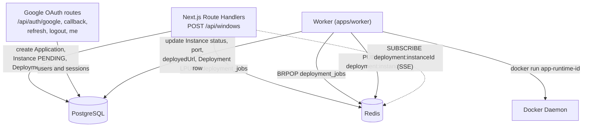

Key facts:

- `POST /api/windows` creates `Application`, `ApplicationInstance` (status `PENDING`, random 6-char `shortId`), a `Deployment` row and a `Window`, then pushes a `deploy` job onto the `deployment_jobs` Redis list.
- The worker blocks on `BRPOP deployment_jobs`, validates the payload against `DeploymentJobSchema`, and runs `deployInstance` or `stopInstance`.
- Deployment events (`@repo/deployment`) are persisted to Postgres first, then published to the `deployment:<shortId>` Redis channel so the browser's SSE connection always sees consistent state.
- Gateway authentication relies on the `access_token` JWT cookie issued by the web app's Google OAuth flow.

## 4. Data Plane

The Data Plane routes high-frequency real-time WebRTC media and input traffic. Signaling goes through the Gateway; media and data channels connect the browser directly to the container over UDP.

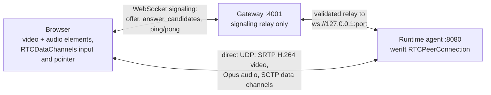

The Gateway never touches media. Once the SDP exchange completes, packets flow browser-to-container directly (host-mapped UDP ports for ICE).

## 5. Deployment Lifecycle

Two related state machines exist:

**Instance status** (`InstanceStatus` enum in Prisma): `PENDING -> CREATING -> STARTING -> WAITING_READY -> READY -> STOPPING -> STOPPED`, plus `FAILED`. The worker writes terminal values: `READY`, `FAILED`, or `STOPPED` (from a `stop` job).

**Deployment phases** (drives SSE progress UI, `@repo/deployment`):

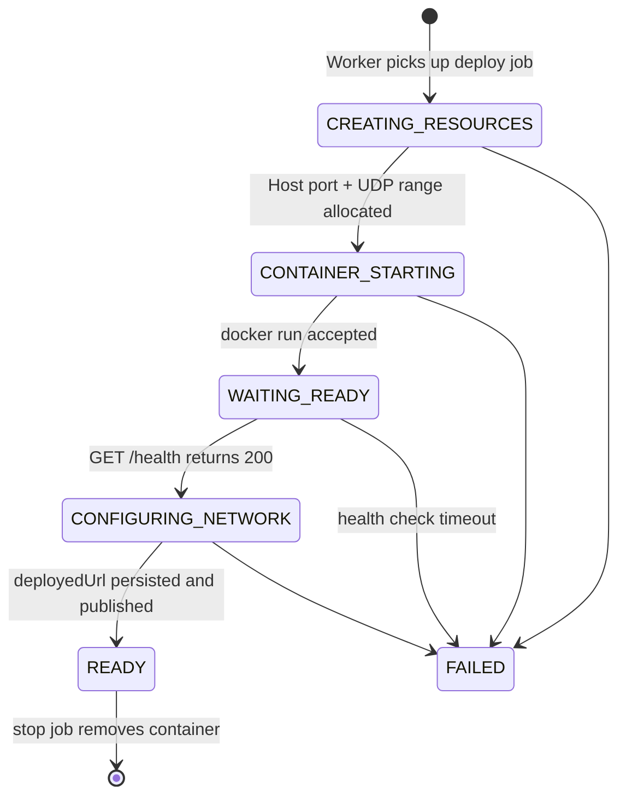

| Phase | Display | Progress |
| --- | --- | --- |
| `CREATING_RESOURCES` | Setting up environment... | 11% |
| `CONTAINER_STARTING` | Starting application... | 44% |
| `WAITING_READY` | Waiting for application to start... | 55% |
| `CONFIGURING_NETWORK` | Configuring network access... | 75% |
| `READY` | Ready | 100% |
| `FAILED` | Application failed to start | 100% |

On success the worker stores `deployedUrl` in the format
`{GATEWAY_WS_URL}/session/{shortId}?port={port}&token={sessionToken}`
(e.g. `ws://localhost:4001/session/a1b2c3?port=33211&token=<uuid>`).

Supported applications (`APP_CONFIG` in the worker): `orbit-chromium` (chromium), `orbit-vscode` (VS Code), `orbit-terminal` (xfce4-terminal). Each maps to `APP_COMMAND` / `APP_WINDOW_CLASS` env vars consumed by the runtime agent.

## 6. SSE Progress Streaming

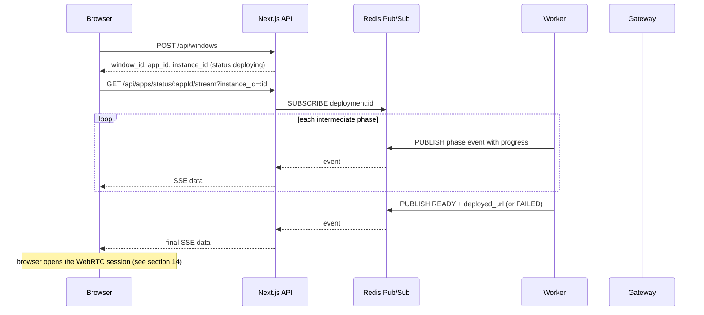

The stream route registers its Redis listener before subscribing, so a fast deployment cannot publish its terminal event into the subscribe/listener gap.

## 7. Container Architecture

Each instance runs one container (`app-runtime-{shortId}`) built from `runtime/agent/Dockerfile` (plus `Dockerfile.vscode` / `Dockerfile.terminal` variants):

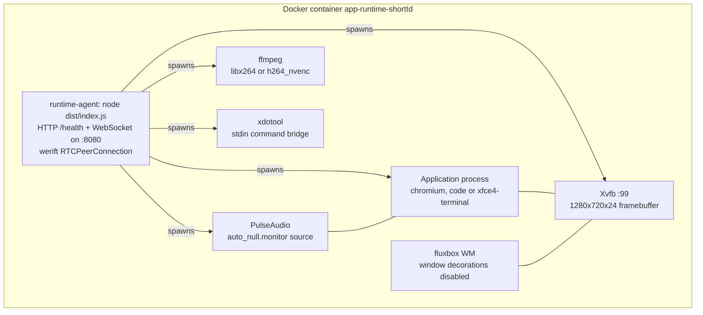

- The agent exposes `GET /health` (200 once the app window is visible, 503 while starting); the worker polls this during `WAITING_READY`.
- The agent's WebSocket requires the `SESSION_TOKEN` env var to match the `?token=` query parameter; only one active signaling client is allowed per container (a new authorized connection replaces the old one).

## 8. Media Pipelines

### Display (video)

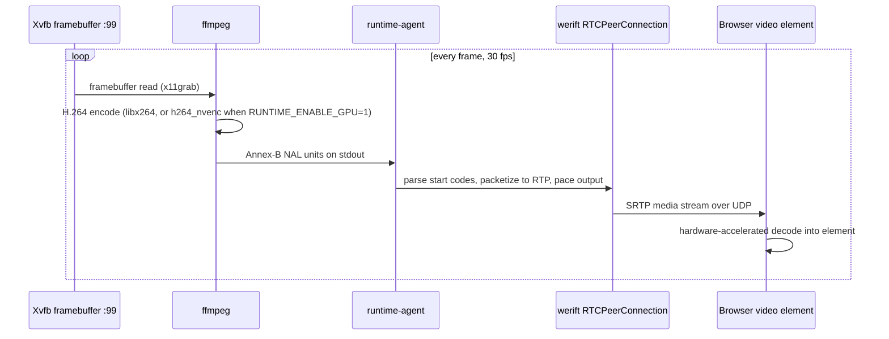

Receiver PLI requests trigger keyframe regeneration (`onPictureLossIndication` -> `requestKeyframe`).

### Audio

PulseAudio's null-sink monitor is captured by the agent, encoded to Opus, and sent as a second media track on the same `MediaStream`. The browser attaches the audio track to a muted-until-playing `<audio>` element.

## 9. Input Pipeline

Input travels over two RTCDataChannels created by the browser:

- `input` - ordered/reliable: keyboard, mouse buttons, scroll, latency pings.
- `pointer` - unordered with `maxRetransmits: 0`: transient mouse moves that must never queue ahead of clicks.

The signaling WebSocket also accepts `input` messages as a fallback path.

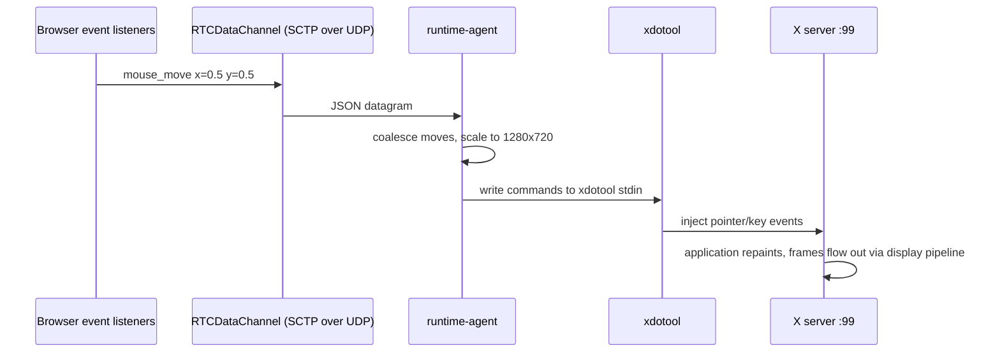

Event types handled by `InputDispatcher`: `mouse_move`, `mouse_button`, `scroll` (coalesced), `key` (DOM codes translated to X keysyms via `keymap.ts`). Latency is measured with `ping`/`pong` over the `input` channel.

## 10. Gateway Session Validation and Routing

The Gateway is the only publicly reachable WebSocket endpoint. On every `/session/{shortId}?port=&token=` connection it performs, in order:

1. Parameter presence check (`instanceId`, `port`, `token`) and integer port validation.
2. JWT verification of the `access_token` cookie (`jose`).
3. Instance lookup in Postgres: must exist, be `READY`, and expose the same `port`.
4. Ownership check: instance's workspace `userId` must match the JWT subject.
5. Token check: `?token=` must equal the token embedded in the stored `deployedUrl`.
6. Connects to the agent at `ws://127.0.0.1:{port}?token={token}`, retrying up to 10 times (300 ms apart), then sends `signaling_ready` and flushes queued browser messages.

Only whitelisted message types are forwarded in either direction: `offer`, `answer`, `candidate`, `signaling_ready`, `ping`, `pong`. Everything else is dropped.

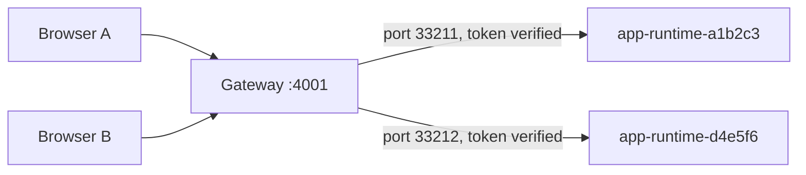

## 11. Reconnect Behavior

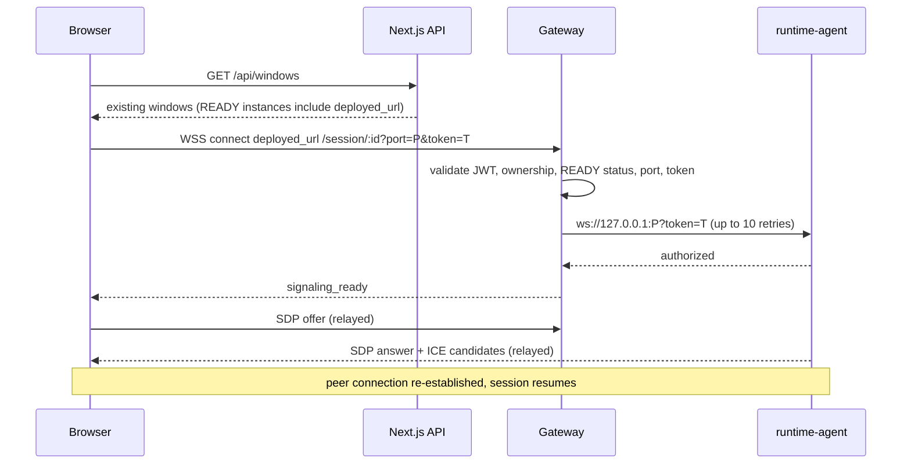

The client schedules reconnects with exponential backoff (250 ms doubling to a 4 s cap) when signaling times out, no video frame arrives within 10 s, or the peer connection enters `failed`/`closed`.

## 12. Failure Behavior

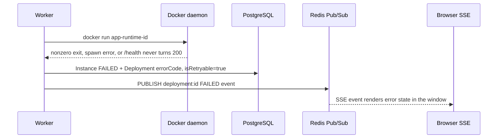

Failures during any pre-READY phase mark the deployment `FAILED` with `is_retryable: true`; the UI surfaces the error and allows redeploying the window.

## 13. Security Boundaries

- Containers run as the non-root user `orbit`; no host filesystem mounts and no Docker socket mounts.
- The browser only ever talks to the Next.js API and the Gateway - never to Docker or the container port directly (the agent socket is reachable on loopback of the host only).
- The Gateway enforces layered authorization: JWT cookie, instance existence, `READY` status, port equality, workspace ownership, and per-deployment session token.
- The agent independently enforces `SESSION_TOKEN` and allows a single active signaling session per container.
- The Gateway whitelists signaling message types in both directions.
- Containers are started with `--shm-size=1g`; GPU devices are attached only when `RUNTIME_ENABLE_GPU=1`. Note: `seccomp=unconfined` is currently required for the Chromium sandbox in this setup - revisit before multi-tenant deployment.
- Per-instance isolation: random 6-char `shortId` plus a fresh `crypto.randomUUID()` session token per deployment.

## 14. WebRTC Connection Setup

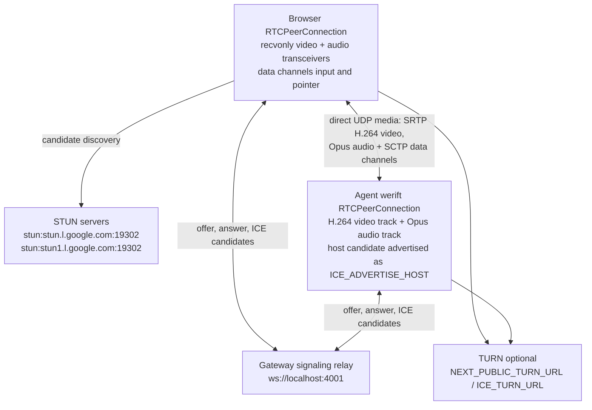

Networking notes:

- The worker allocates a free TCP host port (mapped to the agent's 8080) and a contiguous UDP range for ICE, passed to the container as `ICE_PORT_MIN` / `ICE_PORT_MAX`.
- Docker's STUN-mapped (srflx) candidates are suppressed by default because their mapped ports are not published; the host candidate rewritten to `ICE_ADVERTISE_HOST` is the valid path. Set `ICE_ADVERTISE_SRFLX=1` to override.
- Video codec is fixed to H.264 (`useH264`), audio to Opus (`useOPUS`); ICE is IPv4-only UDP (`iceUseIpv6: false`, `iceUseTcp: false`).
- Screen resolution is 1280x720 at 30 fps; the encoder switches between `libx264` and `h264_nvenc` based on `RUNTIME_ENABLE_GPU`.

### Why WebRTC

- **Low latency**: native hardware-accelerated decoding straight into the `<video>` element, typically sub-50 ms glass-to-glass on LAN.
- **Adaptive**: the WebRTC stack adjusts bitrate/resolution/framerate to network conditions; PLI-driven keyframes enable instant recovery after loss.
- **Efficient input**: keyboard/pointer events ride SCTP data channels over the same UDP path as media - the `pointer` channel trades reliability for freshness.
